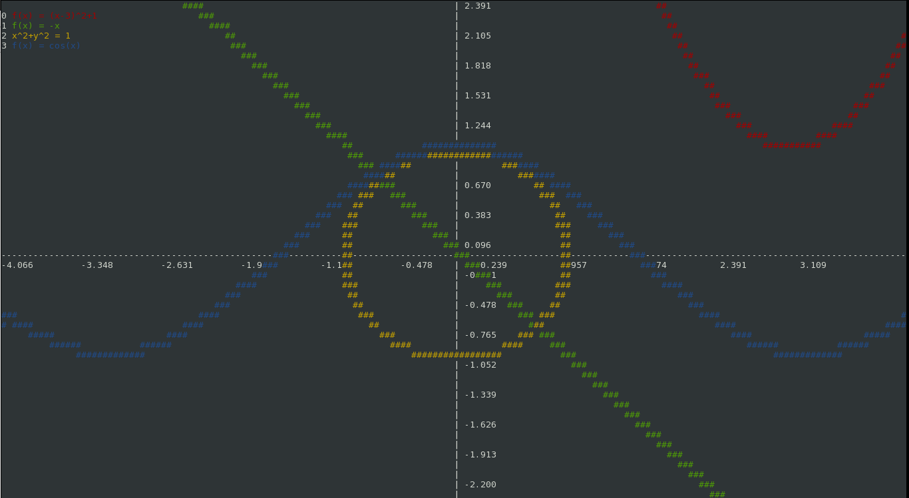

# termplot
Terminal-based mathematical function plotter

# Try it out

First you have to clone the repository
    git clone https://github.com/gciruelos/termplot.git
    cd termplot

Now build and run
    make
    ./termplot

#How to use

Termplot supports vim-like commands, so you can type
    
    :plot sin(x^2)

And it will work. Termplot can also plot implicit functions, like

    :implicit x^2+y^2 = 1

#Screenshots

